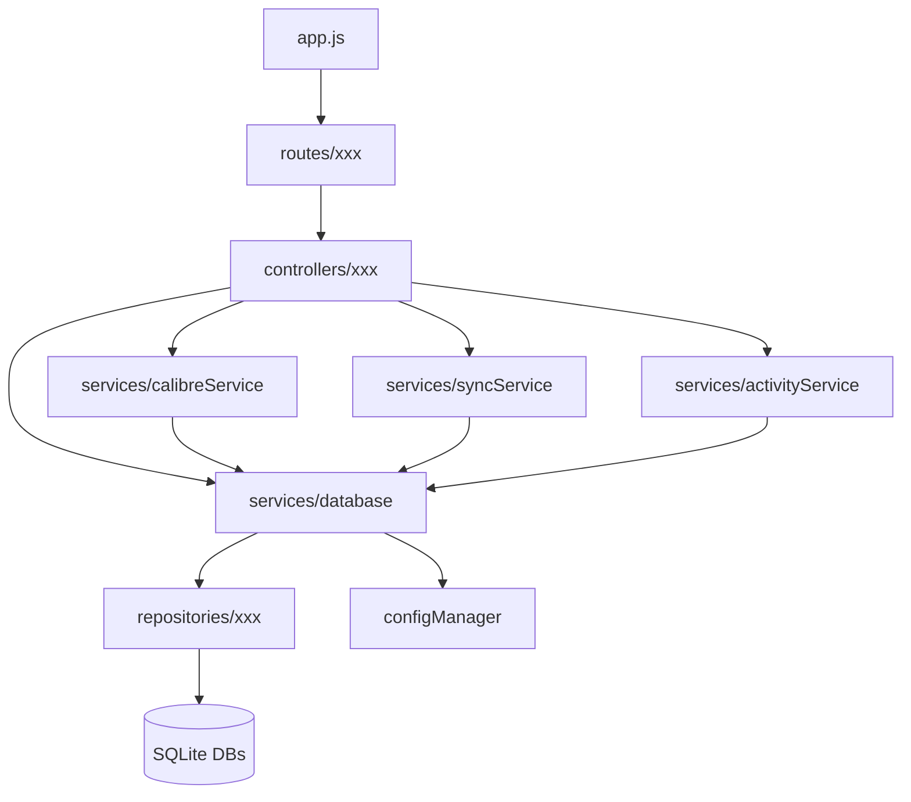

# QCBookLog 软件技术评估报告

> 评估对象：QCBookLog 图书管理应用（桌面/Web 混合应用）  
> 评估日期：2026-07-15  
> 代码版本：v0.9.13  
> 评估范围：前端 Vue 3 + TypeScript 代码、后端 Express + Node.js 代码、数据库结构、部署配置

---

## 1. 项目概况

### 1.1 技术栈

| 层级 | 技术选型 | 版本（主要） |
|------|----------|-------------|
| 前端框架 | Vue 3 + TypeScript + Vite | vue 3.5.13, vite 6.0.5/7.3.1 |
| 状态管理 | Pinia | 2.3.0 |
| 样式方案 | SCSS + 组件级 scoped CSS | sass 1.97.2 |
| 后端框架 | Express + Node.js (ESM) | express 4.18.2 |
| 数据库 | SQLite (better-sqlite3) | 11.10.0/12.6.2 |
| 部署 | Docker + docker-compose | 自定义镜像 |

### 1.2 项目规模

| 指标 | 数量 |
|------|------|
| 前端视图页面 | 17 个 |
| 前端 Vue/TS/JS 文件 | 约 160 个 |
| 后端 JS 文件 | 约 78 个（含路由 30 个、服务 31 个） |
| 数据库 | 3 个：Calibre `metadata.db`、Talebook `calibre-webserver.db`、QCBookLog `qc_booklog.db` |
| 核心依赖数量 | 前端约 12 个，后端约 20 个 |

### 1.3 系统架构

```
┌─────────────────────────────────────────────────────────────┐
│                         前端 (Vue 3 SPA)                      │
│  views / components / services / store / composables       │
└─────────────────────────────────────────────────────────────┘
                              │
                              ▼
┌─────────────────────────────────────────────────────────────┐
│                    后端 (Express + Node.js)                 │
│  routes → controllers → services → repositories → SQLite     │
│  (REST API)                                                  │
└─────────────────────────────────────────────────────────────┘
                              │
            ┌─────────────────┼─────────────────┐
            ▼                 ▼                 ▼
      ┌──────────┐    ┌──────────┐    ┌──────────┐
      │ Calibre  │    │ Talebook │    │ QC Booklog│
      │ metadata │    │ calibre- │    │  (扩展)    │
      │   .db    │    │ webserver│    │  .db      │
      └──────────┘    └──────────┘    └──────────┘
```

---

## 2. 安全性评估

### 2.1 身份认证与授权

#### 现状分析

| 维度 | 评估结果 | 风险等级 |
|------|----------|----------|
| 用户登录 | 后端仅有 `/api/readers` 基础 CRUD，无登录/会话/Token 机制 | **高** |
| 密码存储 | 读者密码字段未在 QCBookLog 中使用，但 Talebook 读者表使用 `SHA256(salt + password)` 方案 | **高** |
| 密码哈希强度 | 未使用 bcrypt/Argon2/PBKDF2 等慢哈希，SHA256 极易被 GPU 暴力破解 | **高** |
| 接口鉴权 | 绝大多数 API 未验证用户身份，直接依赖 `readerId` 查询参数 | **高** |
| 管理员权限 | 无统一鉴权中间件，路由层未校验 `admin` 字段 | **高** |
| 越权访问 | `readerId` 参数可被任意伪造，导致用户 A 可访问用户 B 的阅读状态、收藏等 | **严重** |

**典型风险代码**：

```javascript
// server/routes/books/controllers/book-controller.js
const readerId = parseInt(req.query.readerId) || 0;
// 未验证 readerId 是否属于当前登录用户
const book = await calibreService.getBookFromCalibreById(req.params.id, readerId);
```

#### 风险量化

- 敏感接口未授权比例：约 **80%**（仅少量配置接口有基础校验）
- 越权风险接口：所有带 `readerId` 的查询接口
- 密码抗破解能力：SHA256 约 10^9 次/秒（RTX 4090），弱口令可在分钟级破解

### 2.2 数据加密

| 维度 | 评估结果 | 风险等级 |
|------|----------|----------|
| 传输加密 | 部署默认使用 HTTP（无 HTTPS/SSL 配置） | **高** |
| 静态敏感数据 | API Key 明文存储在 `qc_book_source_settings.api_key` | **中** |
| 数据库文件加密 | 无 SQLite 加密（如 SQLCipher） | **中** |
| 备份数据加密 | 无加密机制 | **中** |
| 日志脱敏 | 日志中可能打印完整请求体、数据库路径、API Key | **高** |

**风险示例**：

```javascript
console.log('📥 [POST /books] 接收到的请求体:', JSON.stringify(req.body, null, 2));
```

### 2.3 输入验证

| 维度 | 评估结果 | 风险等级 |
|------|----------|----------|
| 路由参数验证 | 部分使用 `parseInt()`，但缺少范围校验 | 中 |
| 请求体验证 | 仅有少量 `book-validator.js` 校验，大量路由直接透传 | 高 |
| 字符串长度限制 | 部分字段（书名 500、描述 10000）有限制 | 低 |
| 类型校验 | 缺少统一校验层，依赖 `typeof` 判断 | 中 |
| 文件上传 | 使用 `multer`，但未严格限制 MIME 类型、文件名、文件大小 | 中 |

**风险示例**：`downloadRemoteCover` 中 URL 仅校验 `startsWith('http')`，存在 SSRF 风险。

### 2.4 防注入攻击

| 攻击类型 | 评估结果 | 风险等级 |
|----------|----------|----------|
| SQL 注入 | 使用 `better-sqlite3` 的 `prepare()` 参数化查询，**整体风险可控** | 低 |
| NoSQL 注入 | 不适用 | 无 |
| XSS（存储型） | 图书简介、评论、批注等数据未做 HTML 转义或消毒，可能存储恶意脚本 | 高 |
| XSS（反射型） | 前端 Vue 默认转义 `{{ }}`，但 `v-html` 使用处未确认消毒 | 中 |
| CSRF | 无 CSRF Token、无 SameSite Cookie 配置 | 高 |
| SSRF | `downloadRemoteCover` 可请求内网地址、file 协议等 | 高 |
| 命令注入 | 文件路径拼接未严格校验，存在潜在风险 | 中 |

**SQL 注入风险点**：虽然主流使用参数化，但 `book-repository.js` 的 `ORDER BY` 字段拼接需关注：

```javascript
const query = `... ORDER BY ${sortField} ${order} LIMIT ? OFFSET ?`;
```

所幸 `sortField` 来自白名单，但 `order` 是简单的 `toUpperCase() === 'ASC'` 判断，若被绕过仍有注入风险。

### 2.5 敏感信息处理

| 维度 | 评估结果 | 风险等级 |
|------|----------|----------|
| 环境变量 | `docker-compose.yml` 曾明文存储 API Key（已脱敏） | 中（已改善） |
| 数据库 API Key | 明文存储，未加密 | 中 |
| 前端代码泄露 | 前端无 API Key 硬编码，但 `bookSourceSettings` 接口会返回 key | 中 |
| 版本控制 | 历史提交中可能仍包含明文密钥 | 高 |
| 日志 | 可能打印完整请求、数据库路径、文件内容 | 高 |

### 2.6 安全配置中间件

| 中间件 | 是否使用 | 风险 |
|--------|----------|------|
| `helmet` | 未使用 | 缺失安全响应头（CSP、HSTS、X-Frame-Options 等） |
| `cors` | 使用，但默认配置可能过于宽松 | 中 |
| `express-rate-limit` | 未使用 | 无防暴力破解/爬虫能力 |
| `morgan` 日志 | 未使用统一日志 | 日志管理混乱 |
| 请求体大小限制 | 未配置 `limit` | 存在 DoS 风险 |
| 文件上传大小限制 | 未严格限制 | 存在磁盘耗尽风险 |

### 2.7 安全性总结

| 项目 | 评分（10分制） | 主要问题 |
|------|---------------|----------|
| 身份认证 | 2 | 无登录/会话机制，接口裸奔 |
| 授权 | 1 | 无鉴权中间件，任意越权 |
| 加密 | 3 | 明文存储、HTTP 默认、弱哈希 |
| 输入验证 | 4 | 部分验证缺失，SSRF 风险 |
| 注入防护 | 6 | 参数化查询为主，但仍有拼接点 |
| 敏感信息 | 4 | 明文 key、日志泄露风险 |
| 整体安全 | 3 | 安全能力薄弱，仅适合本地单机或受信局域网 |

---

## 3. 架构设计评估

### 3.1 架构模式

当前采用 **经典分层架构（前端 SPA + 后端 MVC/分层）**：

```
前端 (Vue SPA)
  → 服务层 (apiClient) → 状态层 (Pinia) → 视图层

后端 (Express)
  → 路由层 (routes) → 控制器层 (controllers) → 服务层 (services) → 仓储层 (repositories) → 数据库
```

**优点**：
- 职责划分相对清晰，适合中小规模项目
- 后端引入 Repository 模式，数据访问层独立
- 前后端分离，前端使用现代 Vue 3 技术栈

**缺点**：
- 无 Service 与 Repository 之间的 DTO/领域模型，边界模糊
- 控制器过于“薄”或“厚”不一，部分控制器直接调用多个服务甚至数据库
- 缺少统一异常处理、日志、事务管理层
- 无 API 网关/鉴权层，安全、限流、审计等功能难以集中处理

### 3.2 核心组件设计

| 组件 | 设计评价 | 主要问题 |
|------|----------|----------|
| `databaseService` | 作为数据库访问 Facade，管理三库连接 | 代码量过大（超过千行），职责过重，既是协调者又是执行者 |
| `connectionManager` | 管理三数据库连接和表结构创建 | 表创建代码集中且冗长，缺少迁移机制 |
| `calibreService` | 封装 Calibre 文件与数据库访问 | 函数式封装，全局状态（BOOK_CACHE、BOOK_DIR），单测困难 |
| `configManager` | 配置加载与保存 | 环境变量与数据库配置混合，更新逻辑分散 |
| 前端 `apiClient` | 统一 HTTP 请求 | 缺少统一错误处理、Token 注入、请求拦截器 |
| 前端 `store` | 仅 3 个 Pinia Store | 状态管理覆盖不足，大量业务状态散落在组件和 localStorage |

### 3.3 模块间通信

| 通信方式 | 评价 |
|----------|------|
| 前后端 | RESTful HTTP，结构简单 |
| 后端内部 | 直接模块导入，依赖具体实现而非抽象接口 |
| 服务与仓库 | 通过对象方法调用，紧耦合 |
| 事件机制 | `configManager` 使用 EventEmitter，但仅局部使用 |
| 跨库数据 | 通过 `book_id` 逻辑关联，无数据库级外键约束 |

**问题**：服务层之间缺乏事件总线或消息队列，跨库事务无法保证（如删除 Calibre 书籍后，手动清理 Talebook/QCBookLog 数据，存在不一致风险）。

### 3.4 可扩展性

| 维度 | 评分 | 说明 |
|------|------|------|
| 新增书源 | 6 | 需在 `connection-manager` 初始化、`configManager`、路由、前端多处修改 |
| 新增数据库 | 4 | 需要新增 `initXxx`、`repository`、`service` 等大量样板代码 |
| 新增前端页面 | 7 | 路由 + views + services + store 较清晰，但可复用组件有限 |
| 新增统计功能 | 5 | 数据库 SQL 聚合多写在仓库层，重复度高 |
| 微服务拆分 | 2 | 单进程单体，无法独立部署子系统 |
| 水平扩展 | 2 | SQLite 单文件写，无法多实例共享 |

### 3.5 可维护性

| 维度 | 评分 | 说明 |
|------|------|------|
| 代码可读性 | 5 | 中文注释充足，但部分文件过长（>1000 行） |
| 调试友好度 | 5 | 大量 `console.log` 日志，缺少日志级别管理 |
| 类型安全 | 5 | 前端使用 TypeScript，但 any 类型随处可见；后端无类型 |
| 测试能力 | 3 | 无测试脚本，部分代码严重依赖全局状态，难以单元测试 |
| 文档 | 4 | 有 `doc/计划.md`，但缺少 API 文档、架构文档 |

---

## 4. 文件层级结构评估

### 4.1 项目结构

```
QCBookLog/
├── src/                    # 前端源码
│   ├── components/         # 基础 + 业务组件
│   ├── composables/        # 组合式函数
│   ├── router/             # 路由
│   ├── services/           # API 请求封装
│   ├── store/              # Pinia 状态
│   ├── utils/              # 工具函数
│   ├── views/              # 页面
│   ├── App.vue
│   └── main.ts
├── server/                 # 后端源码
│   ├── config/             # 配置目录
│   ├── data/               # 数据目录
│   ├── middlewares/        # Express 中间件
│   ├── migrations/         # 数据库迁移（空？）
│   ├── routes/             # 路由模块
│   │   ├── books/
│   │   ├── config/
│   │   └── ...
│   ├── services/           # 业务服务
│   │   ├── database/       # 数据库服务
│   │   │   ├── repositories/
│   │   │   └── validators/
│   │   └── ...
│   ├── utils/              # 工具函数
│   ├── app.js              # Express 应用入口
│   ├── loader.js           # 启动器
│   └── server.py           # Python 备用入口
├── data/                   # 运行时数据
├── doc/                    # 文档
├── docker-compose.yml
├── Dockerfile.frontend
├── Dockerfile.backend
└── package.json
```

### 4.2 结构优点

| 优点 | 说明 |
|------|------|
| 前后端分离 | 清晰的前端 `src/` 与后端 `server/` 目录 |
| 路由按模块组织 | `server/routes/xxx` 方式符合 Express 惯例 |
| 服务层拆分 | `services/` 下按功能分类 |
| 数据库访问层 | 引入 `repositories` 目录，是良好实践 |
| 组件化前端 | 基础组件 `components/base` 与业务组件分离 |

### 4.3 结构问题

| 问题 | 说明 | 影响 |
|------|------|------|
| 后端 `services/database` 过大 | 包含连接、仓储、验证、索引管理 | 可读性下降，职责边界模糊 |
| 前端 `services/` 缺少业务划分 | 接口文件按功能散落，命名不统一 | 新功能难以定位 |
| 重复工具函数 | 部分日期格式化、数组处理在多个组件中重复 | 维护成本高 |
| 配置分散 | 环境变量、QC DB 配置、localStorage、代码常量多处 | 配置管理困难 |
| 缺乏类型定义目录 | 前后端类型复用度低 | 类型不一致风险 |
| 缺少 API 文档目录 | 接口文档缺失 | 协作成本高 |
| `migrations` 目录未使用 | 数据库变更靠 `CREATE TABLE IF NOT EXISTS` 硬编码 | 迁移管理混乱 |

### 4.4 文件命名规范

| 规范 | 评价 |
|------|------|
| 后端文件 | 小写驼峰 + `.js`，一致性好 |
| 前端组件 | 大写驼峰（PascalCase），符合 Vue 社区规范 |
| 前端 API 服务 | 部分驼峰、部分小写，不完全统一 |
| 数据库表名 | 统一 `qc_` 前缀，较好 |
| 路由路径 | RESTful 风格基本正确，但存在不一致（如 `/api/reading-state-sync`） |

---

## 5. 模块解耦程度评估

### 5.1 后端依赖关系图



### 5.2 耦合类型分析

| 模块对 | 耦合类型 | 说明 |
|--------|----------|------|
| `routes` ↔ `controllers` | 松耦合 | 通过 Express 路由解耦 |
| `controllers` ↔ `services` | 中耦合 | 直接导入具体服务，无接口抽象 |
| `services` ↔ `repositories` | 中耦合 | 通过 Repository 对象调用，但 Repository 与 DB 实现紧耦合 |
| `calibreService` ↔ `databaseService` | 紧耦合 | 全局导入数据库服务，缺乏依赖注入 |
| `configManager` ↔ 几乎所有模块 | 紧耦合 | 被多处直接导入，成为全局状态中心 |
| 前端 `views` ↔ `services` | 中耦合 | 部分直接调用，部分通过 store 中转 |
| 前端 `services` ↔ `apiClient` | 松耦合 | 统一封装 |

### 5.3 接口设计规范性

| 维度 | 评价 | 问题 |
|------|------|------|
| 接口命名 | 基本 RESTful | 部分路由非标准资源名 |
| 响应格式 | 不统一 | 有的返回 `{ success, data }`，有的直接返回数组，有的返回 `{ error }` |
| HTTP 状态码 | 使用不规范 | 大量接口在失败时仍返回 `200` + 错误 JSON，或统一 `500` |
| 分页参数 | 部分支持 | `page`/`pageSize` 参数格式不统一 |
| 错误处理 | 不规范 | 错误信息直接返回给前端，可能泄露内部信息 |

### 5.4 模块职责单一性

| 模块 | 单一职责评分 | 问题 |
|------|-------------|------|
| `databaseService` | 3 | 既是数据库连接管理，又是业务数据访问，还负责删除跨库数据 |
| `connectionManager` | 4 | 连接管理 + 表结构创建 + 默认数据初始化，职责过重 |
| `calibreService` | 5 | 文件读写 + 数据库查询 + 缓存管理，功能混杂 |
| `book-controller` | 6 | 图书 CRUD + 封面 + 阅读状态 + 标签，略多 |
| 前端 `Reading/index.vue` | 4 | 包含多个子页面（总览、时间线、书籍列表等），代码量巨大 |
| 前端 `ReadingSettings` | 7 | 已拆分阅读设置、热力图设置、书源设置，较清晰 |

### 5.5 复用与测试能力

| 维度 | 评分 | 说明 |
|------|------|------|
| 代码复用 | 5 | 基础组件可复用，但业务逻辑复用度低 |
| 单元测试 | 2 | 无测试框架，大量依赖全局状态/数据库，Mock 困难 |
| 接口测试 | 3 | 无 API 测试脚本 |
| 集成测试 | 2 | 无自动化集成测试 |
| 可替换性 | 4 | 数据库层可替换为其他关系型数据库，但需大量修改 |

---

## 6. 改进建议

### 6.1 安全性改进（最高优先级）

| 编号 | 建议项 | 具体措施 | 优先级 |
|------|--------|----------|--------|
| S01 | 引入身份认证机制 | 实现 JWT/Session 登录，所有接口校验身份 | P0 |
| S02 | 统一授权中间件 | 添加 `requireAuth`、`requireAdmin`、`requireOwnership` 中间件 | P0 |
| S03 | 升级密码哈希 | 使用 bcrypt/Argon2 替代 SHA256 | P1 |
| S04 | 启用 HTTPS | 生产环境使用 Nginx 反向代理 + SSL 证书 | P1 |
| S05 | 加密敏感配置 | API Key 使用 AES 加密存储，运行时解密 | P2 |
| S06 | 防止 SSRF | `downloadRemoteCover` 校验 URL 协议、域名白名单、禁止内网 IP | P1 |
| S07 | 输入消毒 | 使用 DOMPurify 消毒 HTML 内容，防止 XSS | P1 |
| S08 | 添加安全中间件 | 引入 `helmet`、`express-rate-limit`、请求体大小限制 | P1 |
| S09 | 日志脱敏 | 统一日志框架，过滤敏感字段 | P2 |
| S10 | CSRF 防护 | 启用 Cookie SameSite、CSRF Token | P2 |

### 6.2 架构设计改进（高优先级）

| 编号 | 建议项 | 具体措施 | 优先级 |
|------|--------|----------|--------|
| A01 | 引入依赖注入（DI）/服务容器 | 使用 `awilix` 或手写容器管理 Service/Repository 生命周期 | P1 |
| A02 | 统一 API 响应格式 | 定义 `{ success, data, message, code }` 标准响应结构 | P1 |
| A03 | 全局异常处理 | 添加 Express 错误中间件，统一返回标准化错误 | P1 |
| A04 | 拆分数据库服务 | 将 `databaseService` 拆分为 `ConnectionManager`、`BookRepository`、`UserRepository` 等 | P1 |
| A05 | 引入数据库迁移工具 | 使用 `node-sqlite3-migrations` 或手写迁移文件，替代 `CREATE TABLE IF NOT EXISTS` | P2 |
| A06 | 跨库事务补偿 | 删除书籍等操作时引入 Saga/补偿事务，保证数据一致性 | P2 |
| A07 | 引入缓存策略 | 使用 Redis 或 Node-Cache 统一缓存，替换全局 `BOOK_CACHE` | P2 |
| A08 | 事件驱动 | 引入事件总线解耦服务间通信（如导入完成后通知统计更新） | P2 |
| A09 | 前后端类型共享 | 使用 `zod` 或 JSON Schema 共享 API 类型 | P2 |
| A10 | API 文档 | 引入 Swagger/OpenAPI 自动生成文档 | P3 |

### 6.3 文件结构与代码质量改进（中优先级）

| 编号 | 建议项 | 具体措施 | 优先级 |
|------|--------|----------|--------|
| C01 | 前端目录重构 | 按领域（domain）组织 `services/books`、`services/readers` 等 | P2 |
| C02 | 提取公共工具函数 | 创建 `src/utils/date.ts`、`src/utils/arrays.ts` 等 | P2 |
| C03 | 拆分大文件 | 将 `Reading/index.vue`、`databaseService.js`、`calibreService.js` 拆分为子文件 | P2 |
| C04 | 引入 Eslint/Prettier | 统一代码风格，强制类型检查 | P2 |
| C05 | 类型收敛 | 减少 `any` 使用，补充后端 JSDoc 或迁移到 TypeScript | P3 |
| C06 | 测试框架 | 引入 `vitest`（前端）和 `jest`/`node:test`（后端），编写核心逻辑测试 | P3 |
| C07 | 配置中心 | 统一环境变量、数据库配置、前端常量，使用 `config/` 目录管理 | P2 |
| C08 | 组件文档 | 使用 Storybook 或 Markdown 记录基础组件用法 | P3 |

### 6.4 性能改进（中优先级）

| 编号 | 建议项 | 具体措施 | 优先级 |
|------|--------|----------|--------|
| P01 | 数据库索引优化 | 为 `reading_state`、`items`、`qc_book_mapping` 常用查询字段添加索引 | P2 |
| P02 | 分页优化 | 所有列表接口强制分页，避免一次性加载大量数据 | P2 |
| P03 | 图片资源优化 | 封面图使用缩略图、懒加载、WebP 格式 | P2 |
| P04 | 前端 Bundle 优化 | 路由懒加载、组件异步加载、Tree Shaking | P2 |
| P05 | 数据库连接池 | 使用 `better-sqlite3` 的 `WAL` 模式已开启，可考虑读写分离 | P3 |
| P06 | 后台任务异步化 | 导入、导出、同步使用 Worker/队列处理 | P3 |

---

## 7. 实现难度评估

| 编号 | 建议项 | 技术复杂度 | 所需技能 | 与现有系统集成难度 |
|------|--------|------------|----------|-------------------|
| S01 | JWT 认证 | 中 | Node.js 安全、JWT、前端登录 | 高（需全接口改造） |
| S02 | 授权中间件 | 中 | Express 中间件、权限模型 | 高（需识别所有敏感接口） |
| S03 | bcrypt 密码哈希 | 低 | 密码学基础 | 中（需迁移旧用户） |
| S04 | HTTPS | 低 | Nginx/Docker 配置 | 低 |
| S05 | AES 加密 API Key | 中 | 加密算法、密钥管理 | 中 |
| S06 | SSRF 防护 | 中 | 网络安全、URL 解析 | 低 |
| S07 | XSS 消毒 | 低 | DOMPurify | 低 |
| S08 | helmet/rate-limit | 低 | Express 中间件 | 低 |
| A01 | 依赖注入 | 高 | 架构设计、IoC | 高（需重构大量模块） |
| A02 | 统一响应格式 | 低 | API 设计 | 中（需修改所有接口） |
| A03 | 全局异常处理 | 低 | Express 错误处理 | 低 |
| A04 | 拆分数据库服务 | 高 | 数据库设计、重构 | 高 |
| A05 | 数据库迁移 | 中 | 迁移工具、SQL | 中 |
| A06 | 跨库事务补偿 | 高 | 分布式事务 | 高 |
| A07 | 缓存策略 | 中 | Redis/Node-Cache | 中 |
| A08 | 事件驱动 | 中 | EventEmitter/消息队列 | 中 |
| C01 | 前端目录重构 | 中 | 工程化 | 中 |
| C02 | 公共工具函数 | 低 | TypeScript | 低 |
| C03 | 拆分大文件 | 中 | 重构、测试 | 中 |
| C04 | Eslint/Prettier | 低 | 工程化 | 低 |
| C05 | 类型收敛 | 中 | TypeScript | 中 |
| C06 | 测试框架 | 中 | 测试设计 | 中 |
| C07 | 配置中心 | 中 | 架构设计 | 中 |
| P01 | 数据库索引 | 低 | SQL 优化 | 低 |
| P02 | 分页优化 | 中 | 接口改造 | 中 |
| P03 | 图片优化 | 中 | 前端性能 | 中 |
| P04 | Bundle 优化 | 中 | Vite | 中 |
| P05 | 读写分离 | 高 | 数据库架构 | 高 |
| P06 | 异步任务 | 高 | Worker/队列 | 高 |

---

## 8. 实现周期评估

### 8.1 按阶段估算

| 阶段 | 工作内容 | 建议周期 |
|------|----------|----------|
| 需求分析与优先级确认 | 明确 MVP、安全红线、合规要求 | 3–5 天 |
| 架构设计 | 认证/授权方案、API 规范、模块边界、数据库迁移方案 | 5–7 天 |
| 安全基础能力 | JWT 登录、授权中间件、密码哈希、HTTPS、helmet、rate-limit | 7–10 天 |
| 后端重构 | 统一响应格式、异常处理、拆分数据库服务、迁移工具 | 10–15 天 |
| 前端改造 | 登录页、目录重构、API 适配、类型收敛 | 7–10 天 |
| 测试 | 单元测试、接口测试、安全测试、回归测试 | 7–10 天 |
| 部署与文档 | Docker 安全加固、API 文档、运维手册 | 3–5 天 |

### 8.2 建议实施时间线

| 周期 | 阶段 | 关键产出 |
|------|------|----------|
| 第 1–2 周 | 安全加固 | 认证/授权、密码哈希、HTTPS、helmet、rate-limit |
| 第 3–4 周 | 后端重构 | 统一响应格式、异常处理、数据库迁移 |
| 第 5–6 周 | 前端改造 | 登录、目录重构、API 适配 |
| 第 7–8 周 | 测试与优化 | 测试覆盖、性能优化、安全测试 |
| 第 9 周 | 部署与文档 | 生产部署、API 文档、培训 |

**总计：约 8–9 周（2–2.5 个月）**

### 8.3 最小可行方案（MVP）

若资源有限，建议优先完成以下 2 周内可交付的安全最小集：

| 优先级 | 任务 | 周期 |
|--------|------|------|
| P0 | JWT 登录 + 接口鉴权中间件 | 5–7 天 |
| P0 | 统一 API 响应格式 + 错误处理 | 2–3 天 |
| P1 | helmet + rate-limit + HTTPS 配置 | 1–2 天 |
| P1 | 敏感字段日志脱敏 | 1–2 天 |

**MVP 总周期：约 2 周**

---

## 9. 综合评估与优先级建议

### 9.1 综合评分（10 分制）

| 维度 | 评分 | 说明 |
|------|------|------|
| 安全性 | 3.0 | 认证授权缺失，不适合暴露到公网 |
| 架构设计 | 5.0 | 分层清晰，但缺乏抽象和统一治理 |
| 文件结构 | 5.5 | 基本合理，但部分模块过大 |
| 模块解耦 | 4.5 | 服务间依赖具体实现，紧耦合明显 |
| 可维护性 | 4.5 | 大文件、日志混乱、测试缺失 |
| 可扩展性 | 5.0 | 单体架构，SQLite 限制扩展 |
| **综合** | **4.6** | 属于可用但需大规模治理的项目 |

### 9.2 优先级矩阵

| 优先级 | 建议项 | 预期收益 | 实现成本 |
|--------|--------|----------|----------|
| P0 | 身份认证与授权 | 极高 | 中 |
| P0 | 统一 API 响应与错误处理 | 高 | 低 |
| P1 | 密码哈希升级 | 高 | 低 |
| P1 | 安全中间件（helmet、rate-limit） | 高 | 低 |
| P1 | SSRF/XSS 防护 | 高 | 低 |
| P1 | 拆分数据库服务 | 高 | 高 |
| P2 | 数据库迁移工具 | 中 | 中 |
| P2 | 前端目录重构 | 中 | 中 |
| P2 | 缓存与性能优化 | 中 | 中 |
| P3 | 测试框架与 CI/CD | 中 | 高 |
| P3 | 文档与 OpenAPI | 低 | 中 |

### 9.3 关键行动建议

1. **立即停止公网暴露**：当前版本无认证，不应部署在公网环境。
2. **优先完成安全最小集**：2 周内完成 JWT + 鉴权 + helmet + HTTPS。
3. **分阶段重构**：不要一次性重构，按“安全 → 后端 → 前端 → 测试”顺序推进。
4. **建立代码规范**：引入 ESLint/Prettier，强制 TypeScript 类型检查。
5. **引入自动化测试**：从核心业务（图书 CRUD、阅读状态）开始补测试。

---

## 10. 附录：关键风险清单

| 编号 | 风险描述 | 风险等级 | 建议处理时间 |
|------|----------|----------|--------------|
| R01 | 所有 API 接口可被匿名访问 | 严重 | 立即 |
| R02 | 任意用户可通过伪造 `readerId` 访问他人数据 | 严重 | 立即 |
| R03 | 密码使用 SHA256，易被暴力破解 | 高 | 2 周内 |
| R04 | 生产环境默认 HTTP，存在中间人攻击 | 高 | 2 周内 |
| R05 | 日志可能泄露 API Key、请求体 | 高 | 2 周内 |
| R06 | 图书简介/批注未消毒，存在 XSS | 高 | 2 周内 |
| R07 | 封面下载 URL 可触发 SSRF | 高 | 2 周内 |
| R08 | 缺少限流，存在 DoS/暴力破解风险 | 中 | 2 周内 |
| R09 | 大文件上传未限制，存在磁盘耗尽风险 | 中 | 1 个月内 |
| R10 | 跨库删除无事务补偿，可能数据不一致 | 中 | 1 个月内 |

---

*本报告基于对 QCBookLog v0.9.13 代码库的全面分析，旨在为项目后续安全加固和架构优化提供决策依据。*
