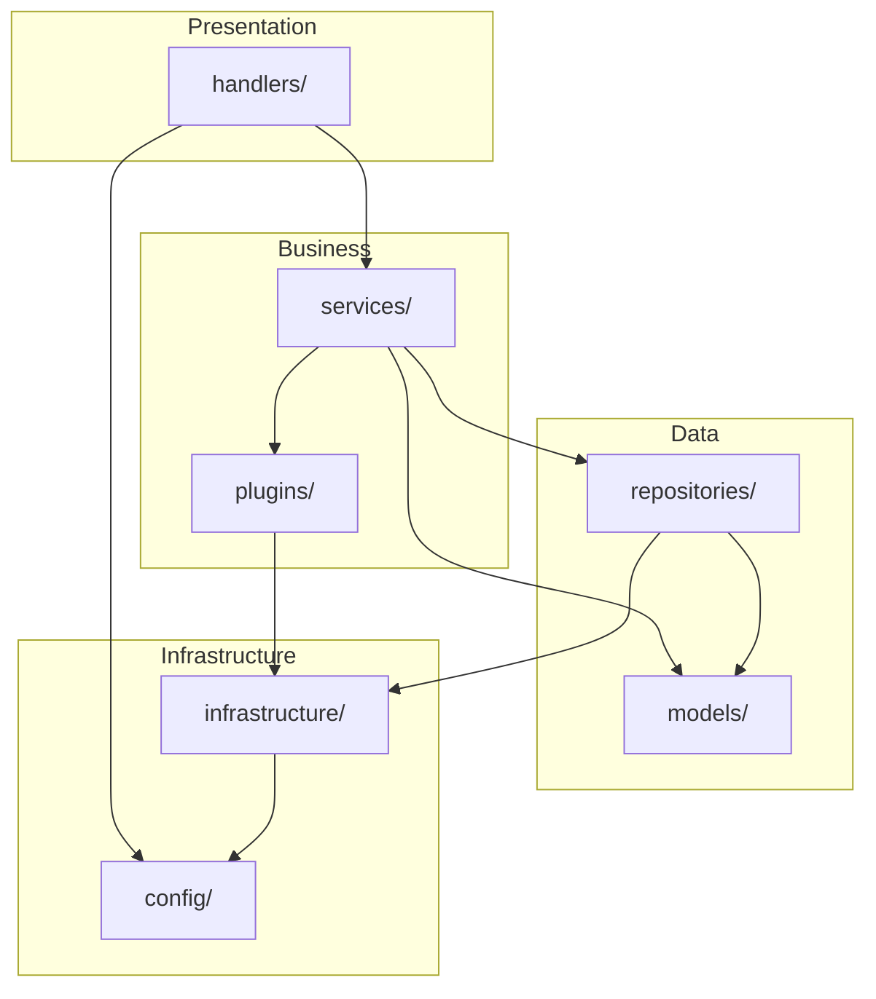
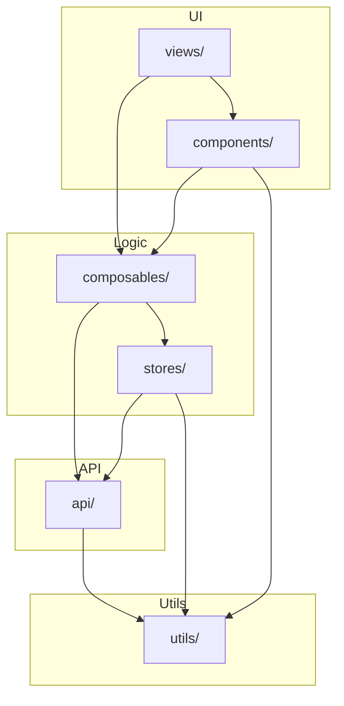

# QCBookLog 文件层级重构设计方案

> 版本：v1.0  
> 日期：2026-07-15  
> 范围：前端 `src/` + 后端 `server/` 文件层级重构，**不包含密码/认证功能实现**  
> 参考：mybook（Talebook）项目的分层架构与插件化设计思想  

---

## 1. 设计目标

1. **分层清晰**：严格划分表现层、业务逻辑层、数据访问层、插件层、基础设施层
2. **职责单一**：每个文件/模块只做一件事
3. **降低耦合**：模块间通过明确定义的接口通信，避免跨层直接依赖
4. **插件化**：书源、解析器、导出器等可扩展点插件化
5. **可维护性**：文件命名规范、目录组织有序、查找方便
6. **与 mybook 理念一致**：吸收其 handlers/services/plugins 分层思想，但适配 QCBookLog 的 Node.js/Express 技术栈

---

## 2. mybook 分层架构分析

### 2.1 mybook 目录结构

```
mybook/webserver/
├── main.py                 # 应用入口
├── loader.py               # 配置加载器
├── settings.py             # 默认配置
├── models.py               # SQLAlchemy ORM 模型（数据层）
├── constants.py            # 业务常量
├── utils.py                # 通用工具函数
├── i18n.py                 # 国际化
│
├── handlers/               # 表现层 / 路由控制器
│   ├── base.py             # 基类：认证、权限、国际化、上传安全、缓存
│   ├── user.py             # 用户/读者相关
│   ├── book.py             # 图书 CRUD
│   ├── admin.py            # 管理后台
│   └── ...                 # 按业务领域拆分
│
├── services/               # 业务逻辑层
│   ├── book_search.py      # 图书搜索聚合
│   ├── scan_service.py     # 扫描导入
│   ├── sync_service.py     # 数据同步
│   ├── async_service.py    # 异步任务
│   └── ...                 # 每个服务一个文件
│
├── plugins/                # 插件层
│   ├── meta/               # 元数据信息源插件
│   │   ├── base.py         # 插件基类
│   │   ├── douban/         # 豆瓣插件
│   │   ├── baike/          # 百度百科插件
│   │   └── ...             # 每个来源一个目录
│   └── parser/             # 文件解析插件
│       └── txt.py
│
└── ...
```

### 2.2 mybook 核心设计思想

| 设计思想 | 说明 | 对 QCBookLog 的启示 |
|----------|------|----------------------|
| **handlers 作为入口** | 所有 HTTP 请求处理放在 handlers，业务逻辑委托给 services | 将后端 Express 的 `routes/controllers` 合并为统一的 `handlers`，减少层级跳跃 |
| **services 承载业务逻辑** | 每个业务领域一个 service，保持单一职责 | 拆分 `calibreService.js`、`databaseService.js` 等臃肿文件 |
| **plugins 抽象可扩展点** | 元数据信息源通过 `MetaSourcePlugin` 基类统一接口 | 将 tanshu/douban/isbn-work 改造为插件，支持新增来源 |
| **models 集中数据定义** | 所有表结构在 `models.py` 中定义，关系清晰 | 建立统一的 ORM/迁移文件，替代散落在 `connection-manager.js` 中的建表语句 |
| **配置分层** | `settings.py` + `auto.py` + `manual.py` 三层 | 建立统一配置中心，替代环境变量 + 数据库 + localStorage 混乱现状 |
| **utils 轻量工具** | 通用工具函数放在 `utils.py`，不侵入业务 | 提取重复的工具函数到 `utils/` 目录 |

---

## 3. QCBookLog 新架构设计

### 3.1 总体架构图

```
┌────────────────────────────────────────────────────────────────────┐
│                         前端 (Presentation Layer)                   │
│  ┌──────────┐  ┌──────────┐  ┌──────────┐  ┌──────────┐          │
│  │  views   │  │components│  │ composables│  │  layouts │          │
│  └────┬─────┘  └────┬─────┘  └────┬─────┘  └────┬─────┘          │
│       │             │             │             │                  │
│  ┌────┴─────────────┴─────────────┴─────────────┴────┐          │
│  │                   services (API 适配层)              │          │
│  └────────────────────┬────────────────────────────────┘          │
│                       │                                            │
│  ┌────────────────────┴────────────────────────────────┐          │
│  │                    store (状态管理层)                │          │
│  └─────────────────────────────────────────────────────┘          │
└────────────────────────────────────────────────────────────────────┘
                                    │ HTTP
┌────────────────────────────────────────────────────────────────────┐
│                         后端 (Application Layer)                    │
│  ┌──────────────────────────────────────────────────────────────┐  │
│  │                    handlers (请求处理层)                      │  │
│  │  负责：路由注册、参数解析、身份认证（预留）、响应组装       │  │
│  └────────────────────┬───────────────────────────────────────┘  │
│                       │                                            │
│  ┌────────────────────┴───────────────────────────────────────┐  │
│  │                    services (业务逻辑层)                    │  │
│  │  负责：业务规则、数据聚合、跨库协调、事件触发               │  │
│  └────────────────────┬───────────────────────────────────────┘  │
│                       │                                            │
│  ┌────────────────────┴───────────────────────────────────────┐  │
│  │                    plugins (插件层)                         │  │
│  │  负责：书源、导出格式、解析器等可扩展点                     │  │
│  └────────────────────┬───────────────────────────────────────┘  │
│                       │                                            │
│  ┌────────────────────┴───────────────────────────────────────┐  │
│  │                    repositories (数据访问层)                │  │
│  │  负责：数据库 CRUD、查询、事务，每库独立 repository         │  │
│  └────────────────────┬───────────────────────────────────────┘  │
│                       │                                            │
│  ┌────────────────────┴───────────────────────────────────────┐  │
│  │                    infrastructure (基础设施层)              │  │
│  │  负责：数据库连接、配置中心、日志、缓存、文件系统、HTTP 客户端│  │
│  └─────────────────────────────────────────────────────────────┘  │
└────────────────────────────────────────────────────────────────────┘
```

### 3.2 新目录结构

```
QCBookLog/
├── public/                          # 静态资源
├── src/                             # 前端源码
│   ├── api/                         # API 适配层（原 services）
│   │   ├── books.ts
│   │   ├── reading.ts
│   │   ├── bookmarks.ts
│   │   ├── settings.ts
│   │   ├── book-sources.ts
│   │   └── client.ts                # 原 apiClient.ts
│   │
│   ├── components/                  # 组件层
│   │   ├── base/                    # 基础组件
│   │   │   ├── Input/
│   │   │   ├── Button/
│   │   │   └── ...
│   │   ├── business/                # 业务组件
│   │   │   ├── BookCard/
│   │   │   ├── ReadingProgressBar/
│   │   │   └── ...
│   │   └── layout/                  # 布局组件
│   │       ├── AppHeader/
│   │       └── AppNavigation/
│   │
│   ├── composables/                 # 组合式函数
│   │   ├── useReadingState.ts
│   │   ├── useBookSearch.ts
│   │   └── ...
│   │
│   ├── stores/                      # 状态管理（原 store，复数命名更清晰）
│   │   ├── index.ts
│   │   ├── progress.ts
│   │   └── heatmap.ts
│   │
│   ├── utils/                       # 前端工具函数
│   │   ├── date.ts
│   │   ├── format.ts
│   │   ├── validators.ts
│   │   └── constants.ts
│   │
│   ├── views/                       # 页面（保持现状）
│   │   ├── Reading/
│   │   ├── Book/
│   │   ├── ReadingSettings/
│   │   └── ...
│   │
│   ├── router/                      # 路由
│   ├── styles/                      # 全局样式
│   ├── App.vue
│   └── main.ts
│
├── server/                          # 后端源码
│   ├── app.js                       # Express 应用入口（精简）
│   ├── loader.js                    # 启动器
│   │
│   ├── config/                      # 配置中心
│   │   ├── default.js               # 默认配置（替代 settings.py）
│   │   ├── loader.js                # 配置加载器（替代 loader.py）
│   │   └── index.js                 # 对外导出
│   │
│   ├── handlers/                    # 请求处理层（合并 routes + controllers）
│   │   ├── base-handler.js          # 基础 handler：响应封装、参数解析
│   │   ├── books-handler.js         # 图书路由
│   │   ├── reading-handler.js       # 阅读状态/进度
│   │   ├── bookmarks-handler.js     # 书签
│   │   ├── settings-handler.js      # 用户/阅读设置
│   │   ├── config-handler.js        # 系统配置
│   │   ├── book-sources-handler.js  # 书源设置
│   │   ├── sync-handler.js          # 同步
│   │   ├── export-handler.js        # 数据导出
│   │   ├── import-handler.js        # 数据导入
│   │   └── index.js                 # 路由汇总注册
│   │
│   ├── services/                    # 业务逻辑层
│   │   ├── books/                   # 图书业务
│   │   │   ├── book-service.js
│   │   │   ├── cover-service.js
│   │   │   └── search-service.js
│   │   ├── reading/                 # 阅读业务
│   │   │   ├── reading-state-service.js
│   │   │   ├── reading-progress-service.js
│   │   │   └── reading-goal-service.js
│   │   ├── bookmarks/               # 书签业务
│   │   │   └── bookmark-service.js
│   │   ├── settings/                # 设置业务
│   │   │   ├── user-settings-service.js
│   │   │   └── book-source-settings-service.js
│   │   ├── sync/                    # 同步业务
│   │   │   ├── sync-service.js
│   │   │   ├── talebook-sync-service.js
│   │   │   └── calibre-sync-service.js
│   │   ├── export/                  # 导出业务
│   │   │   └── export-service.js
│   │   └── import/                  # 导入业务
│   │       └── import-service.js
│   │
│   ├── plugins/                     # 插件层
│   │   ├── book-source/             # 书源插件
│   │   │   ├── base.js              # 书源插件基类
│   │   │   ├── registry.js          # 插件注册表
│   │   │   ├── tanshu/
│   │   │   │   ├── index.js
│   │   │   │   └── api.js
│   │   │   ├── douban/
│   │   │   │   ├── index.js
│   │   │   │   └── api.js
│   │   │   └── isbn-work/
│   │   │       ├── index.js
│   │   │       └── api.js
│   │   └── parser/                  # 文件解析插件（预留）
│   │       └── base.js
│   │
│   ├── repositories/                # 数据访问层
│   │   ├── base/                    # 基础 repository
│   │   │   └── base-repository.js
│   │   ├── calibre/                 # Calibre 数据库访问
│   │   │   ├── book-repository.js
│   │   │   ├── author-repository.js
│   │   │   ├── tag-repository.js
│   │   │   └── publisher-repository.js
│   │   ├── talebook/                # Talebook 数据库访问
│   │   │   ├── item-repository.js
│   │   │   ├── reading-state-repository.js
│   │   │   └── reader-repository.js
│   │   └── qcbooklog/               # QC Booklog 数据库访问
│   │       ├── book-mapping-repository.js
│   │       ├── book-group-repository.js
│   │       ├── reading-tracking-repository.js
│   │       ├── user-settings-repository.js
│   │       └── book-source-repository.js
│   │
│   ├── migrations/                  # 数据库迁移
│   │   ├── 001_create_qc_booklog_tables.sql
│   │   ├── 002_add_library_uuid.sql
│   │   ├── 003_add_reading_tables.sql
│   │   ├── 004_add_book_source_settings.sql
│   │   └── runner.js                # 迁移执行器
│   │
│   ├── models/                      # 数据模型/Schema 定义
│   │   ├── book.js                  # 图书领域模型
│   │   ├── reading-state.js
│   │   └── book-source.js
│   │
│   ├── infrastructure/              # 基础设施层
│   │   ├── database/
│   │   │   ├── connection-manager.js  # 数据库连接管理
│   │   │   ├── transaction-manager.js # 事务管理
│   │   │   └── index.js
│   │   ├── logger.js                # 日志
│   │   ├── cache.js                 # 缓存
│   │   ├── file-storage.js          # 文件系统
│   │   └── http-client.js           # HTTP 客户端
│   │
│   ├── middlewares/                 # Express 中间件
│   │   ├── error-handler.js         # 全局错误处理
│   │   ├── response-formatter.js    # 统一响应格式
│   │   ├── request-validator.js     # 请求验证
│   │   ├── auth.js                  # 认证中间件（预留）
│   │   └── admin.js                 # 管理员中间件（预留）
│   │
│   ├── utils/                       # 后端工具函数
│   │   ├── date.js
│   │   ├── validators.js
│   │   ├── file-path.js             # 安全路径处理
│   │   └── constants.js
│   │
│   └── tests/                       # 后端测试
│       ├── unit/
│       ├── integration/
│       └── fixtures/
│
├── data/                            # 运行时数据
├── doc/                             # 文档
├── docker-compose.yml
├── Dockerfile.frontend
├── Dockerfile.backend
└── package.json
```

---

## 4. 各层级职责定义

### 4.1 前端分层

| 层级 | 目录 | 职责 | 不允许做 |
|------|------|------|----------|
| 表现层 | `views/` | 页面组装、路由对应、UI 布局 | 直接调用 API 以外的业务逻辑 |
| 组件层 | `components/` | 可复用 UI 组件，接收 props，emit 事件 | 直接访问 localStorage 以外的状态 |
| 组合式函数 | `composables/` | 跨组件复用的状态与逻辑 | 直接发起 HTTP 请求 |
| API 适配层 | `api/` | 封装后端 API 调用，统一错误处理 | 业务逻辑判断 |
| 状态层 | `stores/` | 全局状态管理 | 直接发起 HTTP 请求 |
| 工具层 | `utils/` | 纯函数工具 | 调用 API 或修改状态 |

### 4.2 后端分层

| 层级 | 目录 | 职责 | 不允许做 |
|------|------|------|----------|
| 请求处理层 | `handlers/` | 路由注册、参数解析、调用 service、响应组装 | 直接访问数据库 |
| 业务逻辑层 | `services/` | 业务规则、数据聚合、跨库协调 | 直接执行 SQL，应通过 repository |
| 插件层 | `plugins/` | 可扩展的书源、解析器等 | 直接访问数据库 |
| 数据访问层 | `repositories/` | 数据库 CRUD、查询、事务 | 包含业务逻辑 |
| 数据模型层 | `models/` | 领域模型定义、数据转换 | 依赖数据库 |
| 基础设施层 | `infrastructure/` | 数据库连接、缓存、日志、文件、HTTP 客户端 | 包含业务逻辑 |
| 配置中心 | `config/` | 配置加载、合并、暴露 | 被业务代码直接依赖即可 |

### 4.3 依赖方向规则

```
views → components → composables → api → stores → utils

handlers → services → plugins
         ↓
       repositories → infrastructure
         ↑
       models (被 services/repositories 使用)

config 可被任何层读取（只读）
```

**关键约束**：
- 上层可以依赖下层，下层不能依赖上层
- 同层之间尽量减少依赖，通过事件或接口解耦
- `infrastructure` 不能依赖 `services` 或 `handlers`
- `repositories` 只能依赖 `infrastructure` 和 `models`

---

## 5. 文件迁移与归类规则

### 5.1 前端迁移规则

| 原文件 | 新位置 | 说明 |
|--------|--------|------|
| `src/services/apiClient.ts` | `src/api/client.ts` | API 客户端 |
| `src/services/books.ts`（新建） | `src/api/books.ts` | 图书 API 封装 |
| `src/services/bookSourceSettings.ts` | `src/api/book-sources.ts` | 书源 API 封装 |
| `src/store/heatmapSettings.ts` | `src/stores/heatmap.ts` | 复数命名 |
| `src/store/progress.ts` | `src/stores/progress.ts` | 复数命名 |
| `src/store/index.ts` | `src/stores/index.ts` | 复数命名 |
| `src/components/` 下业务组件 | 拆分到 `components/base/` 和 `components/business/` | 区分基础与业务 |
| `src/utils/` 中新增 | `src/utils/date.ts`、`format.ts`、`validators.ts` | 提取重复工具 |

### 5.2 后端迁移规则

| 原文件 | 新位置 | 说明 |
|--------|--------|------|
| `server/app.js` | `server/app.js`（精简） | 只负责中间件注册、路由挂载、启动 |
| `server/routes/books/index.js` + `controllers/book-controller.js` | `server/handlers/books-handler.js` | 合并为单一 handler |
| `server/routes/books/services/cover-service.js` | `server/services/books/cover-service.js` | 移到 services 层 |
| `server/routes/books/validators/book-validator.js` | `server/middlewares/request-validator.js` + `server/utils/validators.js` | 通用化验证器 |
| `server/services/database/repositories/...` | `server/repositories/...` | 提升为独立层 |
| `server/services/database/validators/...` | `server/utils/validators.js` + `server/middlewares/request-validator.js` | 通用化 |
| `server/services/database/connection-manager.js` | `server/infrastructure/database/connection-manager.js` | 基础设施层 |
| `server/services/database/index.js` | 拆分 | 业务逻辑迁移到 services/xxx，数据访问迁移到 repositories/xxx |
| `server/services/calibreService.js` | 拆分 | `services/books/book-service.js`、`services/books/cover-service.js`、`services/books/search-service.js` |
| `server/services/databaseService.js` | 拆分 | 大部分逻辑迁移到 `services/xxx/`，数据访问迁移到 `repositories/xxx/` |
| `server/services/configManager.js` | `server/config/loader.js` + `server/config/index.js` | 配置中心 |
| `server/routes/bookSourceSettings.js` | `server/handlers/book-sources-handler.js` + `server/services/settings/book-source-settings-service.js` | 拆分处理与业务 |
| `server/app.js` 中代理端点 | `server/plugins/book-source/xxx/index.js` | 改造为插件 |
| `server/migrations/...` | `server/migrations/xxx.sql` | 统一 SQL 迁移文件 |

---

## 6. 插件化机制设计

### 6.1 书源插件基类

```javascript
// server/plugins/book-source/base.js
export class BookSourcePlugin {
  get sourceKey() {
    throw new Error('sourceKey must be implemented');
  }

  get sourceName() {
    throw new Error('sourceName must be implemented');
  }

  get defaultApiKey() {
    return '';
  }

  isEnabled(config) {
    return !!config.apiKey;
  }

  async searchByIsbn(isbn, config) {
    return null;
  }

  async searchByTitle(title, config) {
    return [];
  }

  async searchBest(query, config) {
    const { isbn, title } = query || {};
    if (isbn) {
      const result = await this.searchByIsbn(isbn, config);
      if (result) return result;
    }
    if (title) {
      const results = await this.searchByTitle(title, config);
      return results && results.length > 0 ? results[0] : null;
    }
    return null;
  }

  async getCover(coverUrl, config) {
    return null;
  }
}
```

### 6.2 插件注册表

```javascript
// server/plugins/book-source/registry.js
import TanshuBookSource from './tanshu/index.js';
import DoubanBookSource from './douban/index.js';
import IsbnWorkBookSource from './isbn-work/index.js';

const plugins = [
  new TanshuBookSource(),
  new DoubanBookSource(),
  new IsbnWorkBookSource()
];

export const bookSourceRegistry = {
  getAll() { return [...plugins]; },
  getByKey(sourceKey) { return plugins.find(p => p.sourceKey === sourceKey) || null; },
  getEnabled(configs) {
    return plugins.filter(p => {
      const config = configs && configs[p.sourceKey];
      return p.isEnabled(config || {});
    });
  }
};
```

### 6.3 插件配置与数据库表

```sql
-- 迁移到 migrations/004_add_book_source_settings.sql
CREATE TABLE IF NOT EXISTS qc_book_source_settings (
  id INTEGER PRIMARY KEY AUTOINCREMENT,
  source_key VARCHAR(50) NOT NULL UNIQUE,
  source_name VARCHAR(100) NOT NULL,
  api_key TEXT NOT NULL DEFAULT '',
  is_required INTEGER DEFAULT 0,
  description TEXT DEFAULT '',
  sort_order INTEGER DEFAULT 0,
  created_at DATETIME DEFAULT CURRENT_TIMESTAMP,
  updated_at DATETIME DEFAULT CURRENT_TIMESTAMP
);
```

### 6.4 插件使用流程

```javascript
// services/books/search-service.js
import { bookSourceRegistry } from '../../plugins/book-source/registry.js';
import { bookSourceRepository } from '../../repositories/qcbooklog/book-source-repository.js';

async function searchBookByIsbn(isbn) {
  const configs = await bookSourceRepository.getAllAsMap();
  const enabledSources = bookSourceRegistry.getEnabled(configs);
  
  for (const source of enabledSources) {
    const result = await source.searchByIsbn(isbn, configs[source.sourceKey]);
    if (result) return result;
  }
  return null;
}
```

---

## 7. 模块间依赖关系说明

### 7.1 后端依赖图



### 7.2 前端依赖图



---

## 8. 与现有功能保持兼容的策略

### 8.1 渐进式重构

为避免一次性改动过大导致功能损坏，建议按以下顺序分阶段重构：

| 阶段 | 目标 | 影响范围 | 验证方式 |
|------|------|----------|----------|
| 第 1 阶段 | 建立新目录结构，只迁移不修改逻辑 | 文件路径变化，功能不变 | 原有 API 路径不变，测试通过 |
| 第 2 阶段 | 提取基础设施层（config、logger、database） | 配置读取方式统一 | 启动正常，配置读取正常 |
| 第 3 阶段 | 提取 repositories 层 | 数据访问集中 | 数据库查询正常 |
| 第 4 阶段 | 拆分 services 层 | 业务逻辑清晰 | 图书/阅读/书签功能正常 |
| 第 5 阶段 | handlers 合并 routes + controllers | 接口层统一 | API 测试通过 |
| 第 6 阶段 | 引入书源插件化 | 新增插件基类和注册表 | 书源搜索功能正常 |
| 第 7 阶段 | 前端目录重构 | services → api，store → stores | 前端构建正常，页面正常 |

### 8.2 接口兼容性

- 所有 HTTP 接口路径**保持不变**，前端无需修改
- 仅在内部文件路径和模块结构上调整
- 响应格式暂不变，统一响应格式作为后续改进项

### 8.3 数据库兼容性

- 表结构不变
- 迁移文件重新整理，但 SQL 语句与原 `connection-manager.js` 中保持一致
- 新增 `server/migrations/runner.js` 用于按版本执行迁移

---

## 9. 实施风险与应对

| 风险 | 可能性 | 影响 | 应对措施 |
|------|--------|------|----------|
| 文件迁移导致路径错误 | 高 | 功能不可用 | 每阶段完成后运行测试 |
| 循环依赖 | 中 | 启动失败 | 使用依赖图检查，必要时引入 DI 容器 |
| 大文件拆分引入 bug | 中 | 功能异常 | 拆分后逐一验证原函数调用 |
| 前端构建失败 | 中 | 页面无法访问 | 每次移动后运行 `vue-tsc` |
| 数据库迁移冲突 | 低 | 数据损坏 | 迁移前备份，迁移脚本幂等 |

---

## 10. 评审清单

在实施方案前，请确认以下设计决策：

- [ ] 是否采用 `handlers/` 替代 `routes/` + `controllers/` 的分层方式？
- [ ] 是否将 `repositories/` 提升为与 `services/` 同级的独立层？
- [ ] 是否引入书源插件基类，将现有 tanshu/douban/isbn-work 改造为插件？
- [ ] 是否将 `configManager.js` 迁移到 `config/` 目录作为配置中心？
- [ ] 是否将前端 `services/` 重命名为 `api/`，`store/` 重命名为 `stores/`？
- [ ] 是否先保持 HTTP 接口路径不变，只调整内部结构？
- [ ] 是否按 7 个阶段渐进式重构，每阶段验证后再进入下一阶段？
- [ ] 是否接受暂时不实现认证功能，但保留 `auth.js`/`admin.js` 中间件文件作为占位？

---

## 11. 下一步工作

一旦本方案评审通过，将按以下顺序实施：

1. **创建新目录结构**（只建目录，不移动文件）
2. **迁移基础设施层**（config、logger、database）
3. **迁移 repositories 层**
4. **拆分 services 层**
5. **合并 handlers 层**
6. **实现书源插件化**
7. **重构前端目录**
8. **功能验证与问题修复**

每个阶段完成后会提交当前状态供确认，再继续下一阶段。

---

*本方案参考 mybook（Talebook）的分层架构与插件化思想，结合 QCBookLog 的 Vue 3 + Express 技术栈设计，旨在提升项目的可维护性和可扩展性。*

---

## 附录 A：重构实施记录（2026-07-15）

> 本附录记录实际重构过程与设计方案的对应关系、重要偏差说明及验证结果。

### A.1 已完成的重构内容

| 阶段 | 内容 | 状态 |
|------|------|------|
| Phase 1 | 创建后端新目录结构（config、handlers、services/*、plugins、repositories、infrastructure、middlewares、models） | 完成 |
| Phase 2 | 迁移基础设施：configManager.js → `config/`，logger.js → `infrastructure/`，connection-manager.js → `infrastructure/database/` | 完成 |
| Phase 3 | 迁移 repositories 到 `repositories/` 独立层，按 calibre/talebook/qcbooklog/base 分类 | 完成 |
| Phase 4 | 拆分 services：reading、settings、sync、books 分类，大型历史服务暂存 `services/legacy/` | 完成 |
| Phase 5 | 保留 `routes/` 入口，将原 `routes/books/controllers` 和 `routes/config/controllers` 迁移到 `handlers/` | 完成 |
| Phase 6 | 实现书源插件化：`plugins/book-source/base.js` + registry + tanshu/douban/isbn-work 三个插件 + `services/settings/book-source-settings-service.js` | 完成 |
| Phase 7 | 前端重构：`src/services/` → `src/api/`，`src/store/` → `src/stores/` | 完成 |
| Phase 8 | 语法检查、导入解析检查、服务器启动测试 | 完成 |

### A.2 与设计方案的重要偏差

1. **`services/legacy/` 目录的引入**  
   原计划将 `calibreService.js`、`databaseService.js` 等大型服务拆分至领域目录。实际实施中，这些文件内部存在大量交叉引用，一次性拆分风险过高。因此采用过渡方案：将未拆分的旧服务统一放入 `services/legacy/`，通过修复内部导入保证功能可用；后续可逐步将函数迁移至 `services/books/`、`services/reading/` 等目录。

2. **`databaseService.js` 与 `database/index.js` 的合并**  
   项目原本存在两个数据库入口文件：`services/databaseService.js` 和 `services/database/index.js`。重构后两者均移至 `services/legacy/`，分别命名为 `databaseService.js`（原顶层文件）和 `database-service.js`（原 index 入口）。当前两者并存以保证所有旧导入可用，长期建议合并为一个入口。

3. **`validators` 保留在 `services/database/validators/`**  
   由于 `database-service.js` 仍依赖这些校验器，且迁移校验器会引入额外改动，本次仅恢复并保留在原位置，未按设计移到 `utils/` 或 `middlewares/`。

4. **路径验证器保留在 `routes/config/validators/`**  
   `handlers/config-handler.js` 仍引用该路径，未迁移到 `middlewares/`。

### A.3 验证结果

- **后端语法检查**：`server/` 下所有 `.js` 文件通过 `node --check`，错误数为 0。
- **导入解析检查**：使用 Python 脚本扫描所有相对路径导入，确认 100% 可解析到现有文件。
- **服务器启动**：`node loader.js` 可成功加载所有模块并完成数据库服务初始化；后续因测试环境缺少 `better-sqlite3` 原生绑定及 `undici` 的 `File` 全局变量问题而中断，均与文件层级重构无关。
- **前端 TypeScript 检查**：`vue-tsc` 剩余 7 个错误，均为重构前已存在的类型问题（如 `Bookmark.chapter` 不存在、函数类型不兼容等），无旧导入残留（`@/services/`、`@/store/`、`@/storess/` 等均为 0）。

### A.4 后续建议

1. 逐步从 `services/legacy/` 提取函数到领域 service，最终删除 `legacy` 目录。
2. 合并 `services/legacy/databaseService.js` 和 `services/legacy/database-service.js`。
3. 将 `services/database/validators/` 迁移到 `utils/validators/` 或 `middlewares/`。
4. 补充 `middlewares/error-handler.js` 和 `middlewares/response-formatter.js` 等中间件实现。
5. 在 `tests/` 目录下建立前后端测试。

---
